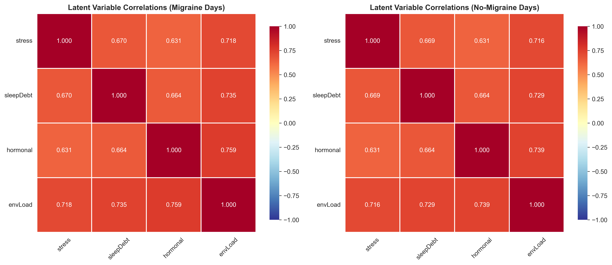
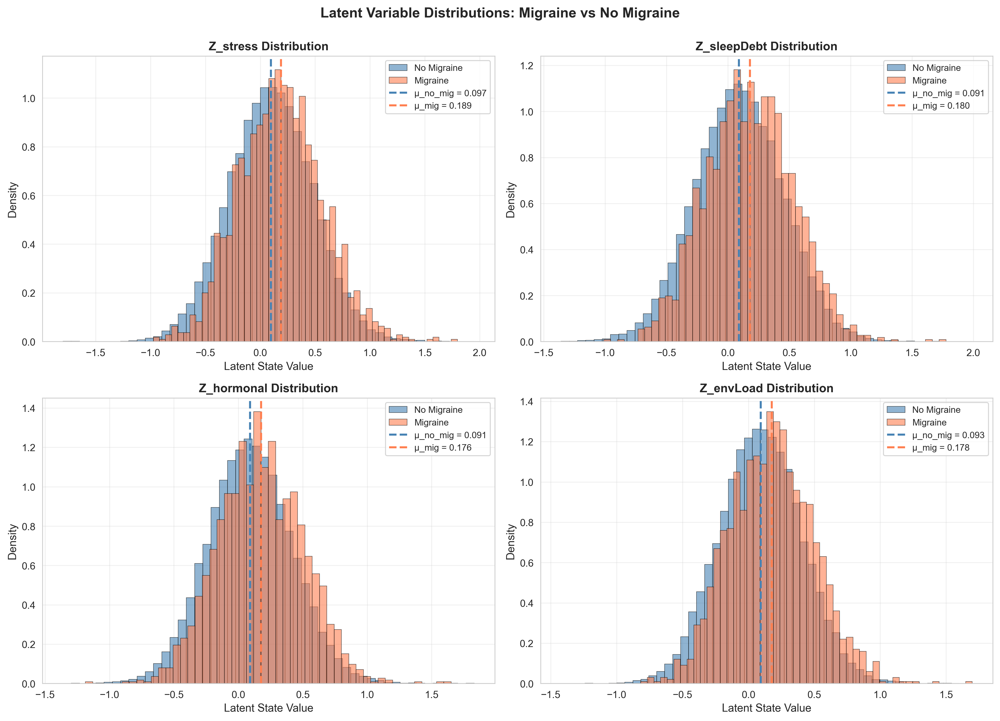
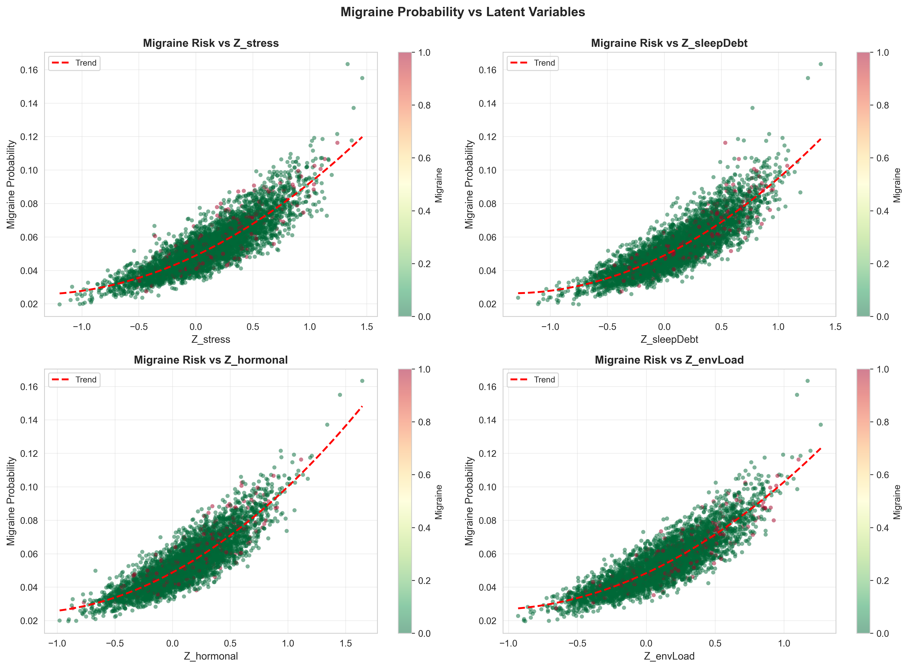
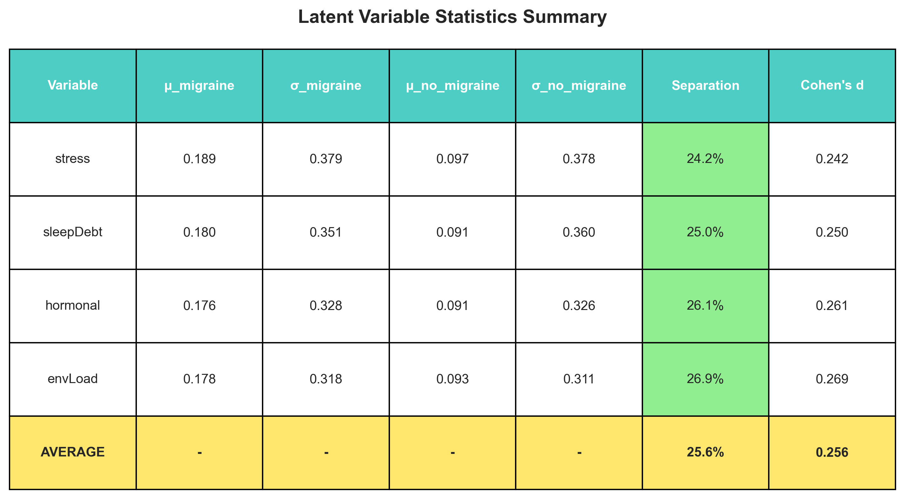
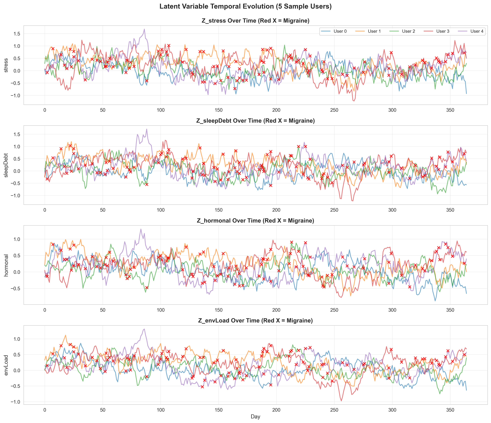
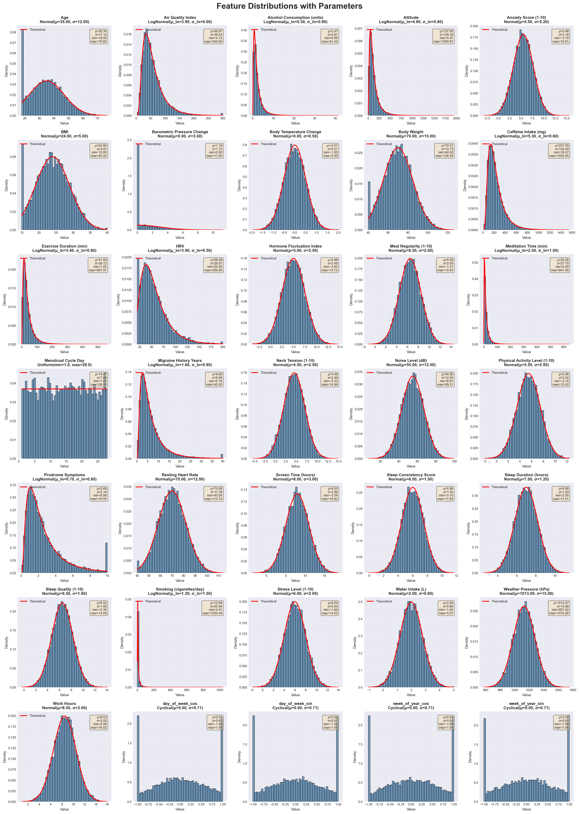
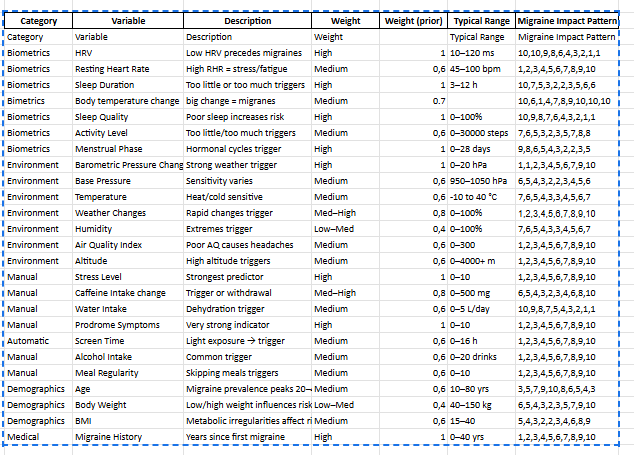

# EASE — Migraine Risk & Guidance (Junction 2025) by Prae Electus

## Live demo link

https://ease-chi.vercel.app

## Team members

Konsta Kiirikki
Aarni Konola
Veikko Svynarenko
Lauri Mäkinen
Markus Määttänen

## Vision

Predict, understand, and reduce migraine risk. EASE shows your risk for today, explains why, and guides actions that help.

## Quick Start

- Local: `npm install` → `npm run dev` → open `http://localhost:3000`
- Docker: `npm run docker:dev` → open `http://localhost:3000`
- Windows tip: portable Node is bundled; if npm isn’t found, run npm with `--prefix "ease"` from the workspace root.

## Key Features

- Risk gauge
- Migrane self reportation
- Quick check
- personized checklist to prevent migraine
- Diary and calender to know how to prepare for the future
- Historic trigger combinations for migraine

## Neural Network (ALINE)

- The ALINE predicts the probabilities to get migraine, by using base indicators and learning personal patterns with policy- and predictor heads.
- The network always updates itself when new information is presented
- Input: 35 variables (sleep, alcohol consumption, weather...)
- Output: probability of migraine
### Synthetic data and latent variables
By using prior distributions from clinical studies, we were able to fit a hidden markov model in a continuous statespace to the features. This allowed us to sample time-series evolution of the migraine probability. Having a synthetic simulator allowed us to pre-train the ALINE on our task. 

Correlation matrix: 
Latent variable distribution: 
Migraine propobility vs latent variables: 
Variable statistic summary: 
Latent variable temporal evolution: 
Feature distribution: 

ALINE (research paper): https://arxiv.org/abs/2506.07259,

## Data

- Susan calendar source: `ALINE/personal_data/susan_data.json` (synthetic)
- Biometics (sleep, screen time...) (synthetic)
- Weather data (pressure, rain...)
- Manually (bmi, age...)

Triggers:  (synthetic)

## Results
- ALINE generalized to the synthetic dataset. 
- No validation/test dataset available to benchmark the algorithm.
- By our estimates, ALINE could be personalized with ~1000 datapoints.
- Further studies need to be conducted to demonstrate effectiviness in real-world applications.

## Team & Credits

- Team Prae Electus with product EASE. Built on the ALINE algorithm and open UI primitives.

## Visual

main page: 
personalized plan: 
